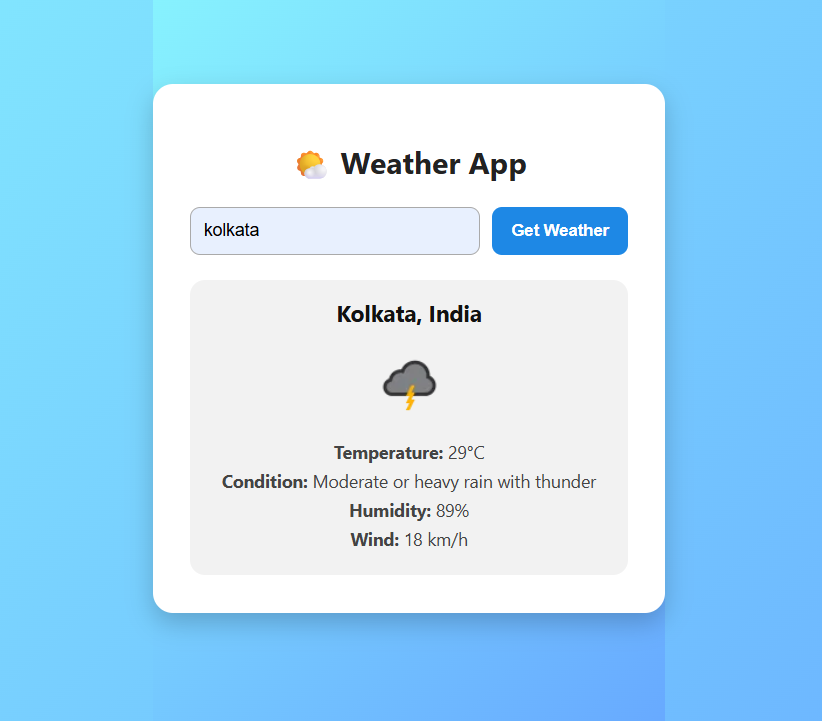

# 🌦️ Weather App

A simple and clean weather web app built with **HTML**, **CSS**, and **JavaScript**, using the [WeatherAPI](https://www.weatherapi.com/) to fetch real-time weather data.

## 🔧 Features

- Get current weather by city name
- Auto-detect user's location using Geolocation API
- Toggle between Celsius (°C) and Fahrenheit (°F)
- View 3-day weather forecast
- Responsive, modern UI

## 🖼️ Preview
Here is how the Weather App looks in action:


## 🚀 How to Run

1. *Clone the repository*
   ```bash
   git clone https://github.com/Shashank9572/weather-app.git
